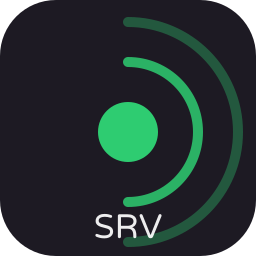

<p align="center">
  
</p>

# AnotherCrewLink Server

Voice relay and signalling server for [AnotherCrewLink](https://github.com/greluc/AnotherCrewLink).

It does three things: it routes WebRTC signalling between players in the same lobby,
it hands clients an ICE configuration, and it keeps the public lobby list. Voice
itself is peer to peer and never passes through this server unless a TURN relay is in
play.

> **Compatibility:** this runs socket.io 4. Clients built on socket.io 2, including
> the original BetterCrewLink client, cannot connect, and the two protocols are not
> interoperable in either direction.

It is written in Rust. It replaced a Node implementation that lived here until
2026-08-24; that history is in the git log, and `docs/rust-port` in the client
repository records why.

## Running it

```bash
cargo build --release
target/release/acl-server
```

Or as a container:

```bash
podman build -t anothercrewlink-server -f Containerfile .
podman run -p 127.0.0.1:9736:9736 -e HOSTNAME=your.host.name anothercrewlink-server
```

The image carries the binary, its healthcheck and the example configuration, and
nothing else — no shell, no package manager. It runs as an unprivileged user.

In production it is not run by hand: `deploy/quadlet/` holds the systemd units, and
`deploy/` has the walkthrough:
the service account, the directories, an nginx block that proxies both the HTTP routes
and the WebSocket upgrade, and how to roll back.

### Environment

There is no dotfile loader. Configuration comes from the process environment —
the quadlet's `EnvironmentFile=`.

| Variable | Meaning |
| --- | --- |
| `PORT` | Listening port. Defaults to 9736. |
| `BIND` | Interface to bind. Defaults to 127.0.0.1. TLS terminates at a reverse proxy, so there is no HTTPS switch and no certificate paths here. |
| `HOSTNAME` | Public hostname. Used as the relay host when the peer configuration does not name one. |
| `PEER_CONFIG` | Path to the peer configuration. Defaults to `config/peerConfig.toml`. |
| `ADDRESS` | The address `/` and `/health` report, so an operator can tell which address a reverse-proxied instance believes it is serving. |
| `NAME` | Server name shown on the status page and in `/health`. |
| `RUST_LOG` | Tracing filter. Defaults to `info`. |

### Peer configuration

Copy `config/peerConfig.example.toml` to `config/peerConfig.toml`. It controls whether
connections are forced through a relay, which TURN relay clients are told about, and
any extra STUN/TURN servers beyond it.

Clients are told about the relay's own host as a STUN server automatically, because a
TURN server answers plain Binding requests as well. No public STUN server is configured
and none is contacted.

It is TOML rather than YAML because the maintained YAML crates for Rust depend on an
archived machine translation of libyaml, and the file is a handful of
url/username/credential fields.

## HTTP endpoints

| Endpoint | What it does |
| --- | --- |
| `GET /` | Status page: connections, lobbies, and the address to point a client at. |
| `GET /health` | JSON: uptime, connection and lobby counts, and the refusal counters below. |
| `GET /lobbies` | The public lobby list. |
| `GET /lobbies/{id}/code` | The code for a public lobby, with `Cache-Control: no-store` — a lobby code is the credential that gates entry to a game. 404 if the lobby is unknown, 410 if it is no longer public. |
| `GET /lobbies/stream` | The lobby list as server-sent events: the whole list once, then updates as they happen. A keep-alive comment every 20 seconds, because nginx cuts an idle upstream at 60 by default and a silently frozen lobby list is worse than an empty one. Send `Last-Event-ID` to resume. |

## What it refuses, and why

Three things behave differently from the Node server this replaced. All three are
deliberate, and every refusal is counted on `/health` — a rule that refuses silently
is indistinguishable from a peer that never connected.

**WebSocket is the only transport.** Both shipping clients already connect with
`transports: ['websocket']`, so nothing in the field regresses, and removing polling
removes the advisory it carried
([GHSA-r635-g3xr-vw7x](https://github.com/advisories/GHSA-r635-g3xr-vw7x)) along with
base64 binary framing and the probe-and-upgrade handshake. A client that does not ask
for the WebSocket transport never gets past the handshake.

**A signal is relayed only to a socket in the sender's own lobby.** Never to a room
name, never back to the sender, and never above 64 KB. The Node server relayed to
whatever target a sender named, and `join` accepts any string as a room — so a name
like `<code>_mobile`, derivable from a six-character lobby code, was enough to receive
whatever a client broadcast there. That included every player's live position. The
cost of closing it is that the OBS overlay feed and the mobile relay, as clients up to
1.0.3 address them, are refused. Voice is unaffected.

**The host of a lobby is the first socket to claim it**, and it holds until that socket
leaves. A later socket claiming to be host is refused rather than taking over the
host's authority over lobby settings.

## Tests

```bash
npm ci
cargo test
```

Unit tests cover the lobby registry and the payload coercion. The integration test in
`tests/wire.rs` starts the server as a child process and drives it with the reference
`socket.io-client` from Node, so the wire format is checked against the implementation
the shipping clients actually use rather than against another copy of our own
assumptions.

That is the only reason `package.json` exists here: it pins the reference client and
nothing else. Without `node` on the PATH and `npm ci` run, the test skips loudly, with
a line saying why, rather than passing quietly having checked less than it appears to.

Supply-chain policy is in `deny.toml` and runs in CI as `cargo deny --locked check`.

## TURN relay

Players behind a symmetric NAT cannot connect to each other directly, so a TURN relay
is what makes those pairs work. This server does not embed one: the relay it used to
ship, node-turn, has been unmaintained since 2022.

Use [coturn](https://github.com/coturn/coturn) instead. It ships as the second container
in `deploy/quadlet/`, and there is **one** thing to configure:

```bash
openssl rand -base64 32     # this becomes TURN_SECRET in ~/.config/acl/acl.env
```

coturn takes that as `--static-auth-secret` and this server derives a time-limited
credential per client from the same value, so there is no username or password to write
down twice and no shared password handed to every player. Set `enabled = true` under
`[relay]` in `peerConfig.toml`; the host and port come from the environment.

coturn needs its listening port and its relay range reachable from the internet — the
range defaults to 49160-49800 here rather than coturn's own 49152-65535, because every
port in it has to be forwarded. See
[deploy/coturn-dynamic-ip.md](deploy/coturn-dynamic-ip.md) for what the router, the line
and DNS have to provide, including the case where the public address changes.

Without a relay the server still works, and most players will still connect directly.

## Licence

GPL-3.0-or-later. Forked from
[BetterCrewLink-Server](https://github.com/OhMyGuus/BetterCrewLink-server), which
forked [CrewLink-server](https://github.com/ottomated/CrewLink-server).
